# Travelaza
This repository contains files for the travelaza app

## Intro
Travelaza is a cross platform productivity mobile application that will help travellers in planning their trips with ease, as compared to arduous travelling without any planning. The app helps the users in managing their most important resources - time and also money during their trips. The app also incorporates a multitude of other useful features that a traveller needs such as travel blogs, currency converter, weather updates etc., all  which will lead to a better and more delightful trip.

The application was developed using Flutter which is an open-source UI software development kit created by Google for the front-end.
Firebase, Google Cloud Platform Services and Google Maps API were used for implementing the backend of the application.

## Features
Users of the application can
1. Create and fully customise their daily trip schedule - hour by hour.
2. Track and manage the trip budget that will be spend every day of the trip
3. Read as well as post travel blogs about your own experience while visiting certain places 
4. Catch up with the latest weather updates
5. Check up to date currency exchange and know how much your money is worth
6. Get help with language translation which can be a burden while travelling to places where the language is a barrier. 

## 📸 ScreenShots

| 1 | 2 |
|------|-------|
||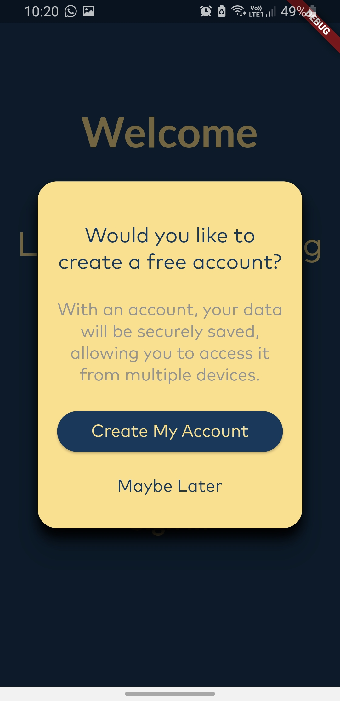|

| 3 | 4|
|------|-------|
|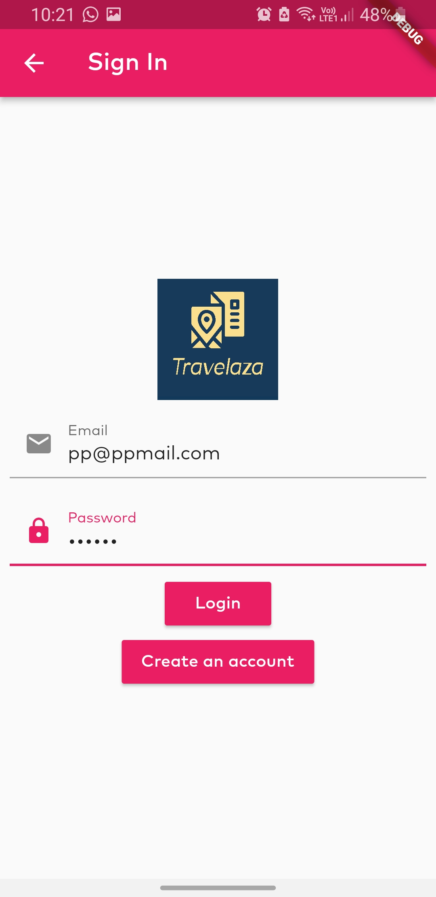|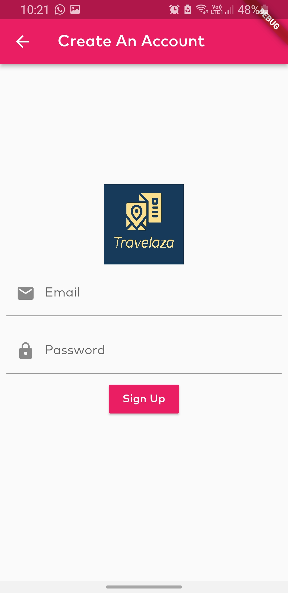|

| 5 | 6|
|------|-------|
||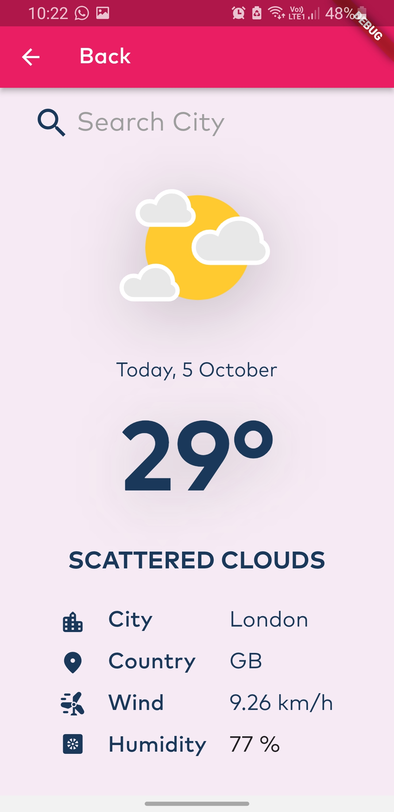|

| 7 | 8|
|------|-------|
|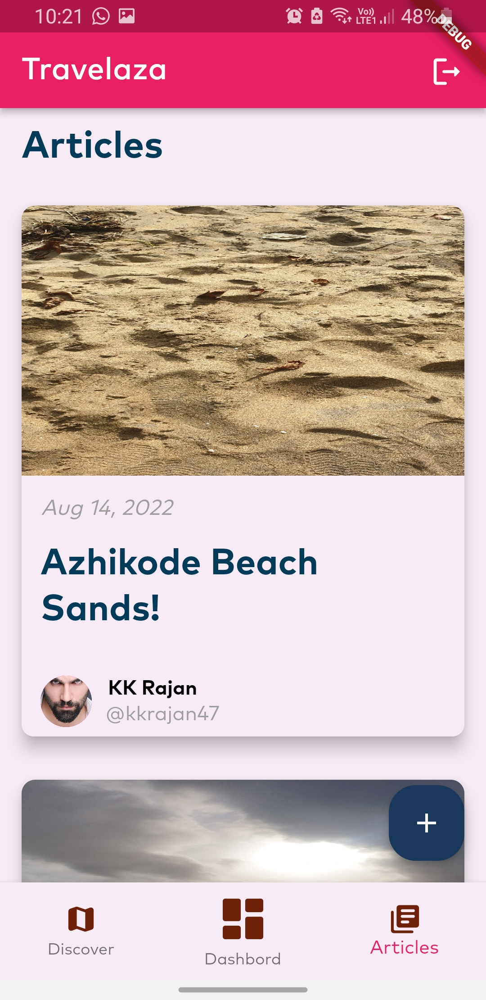|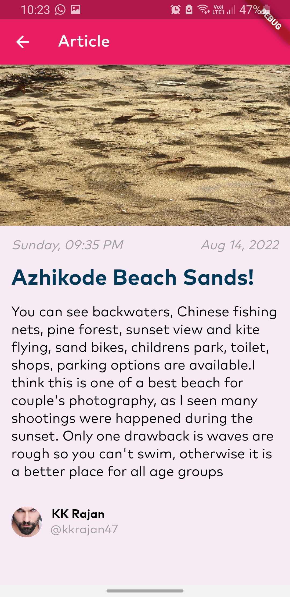|

| 9 | 10|
|------|-------|
|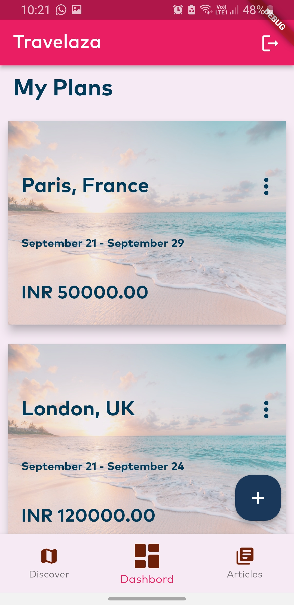|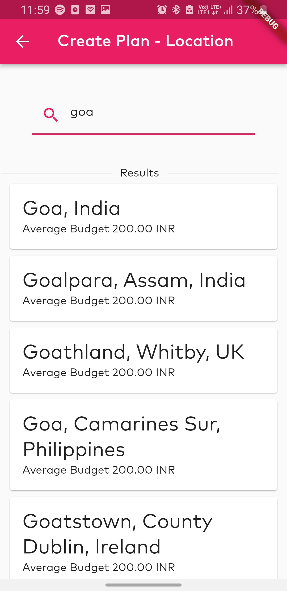|

| 11 | 12|
|------|-------|
|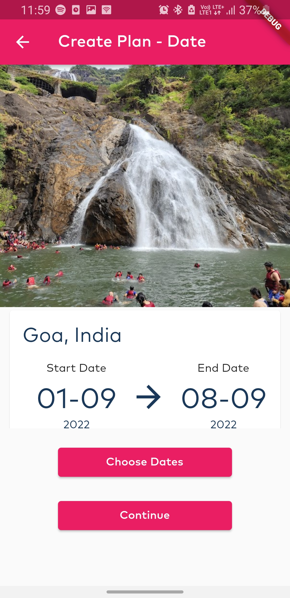|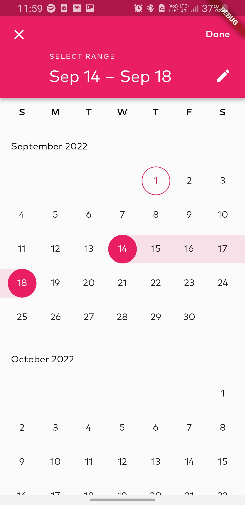|

| 13 | 14|
|------|-------|
|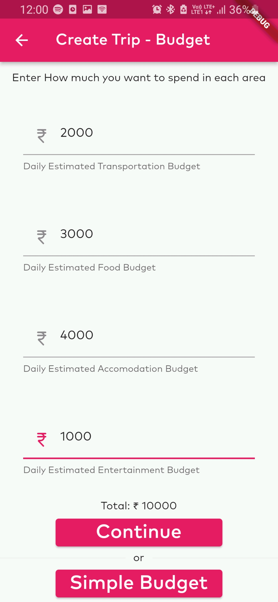|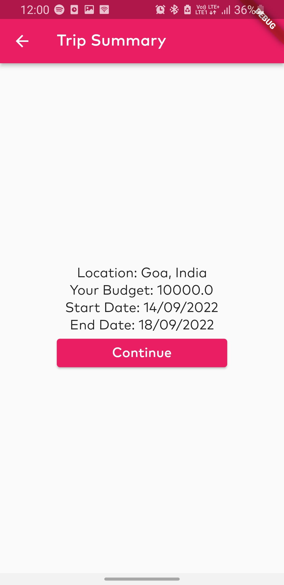|

| 15 | 16|
|------|-------|
|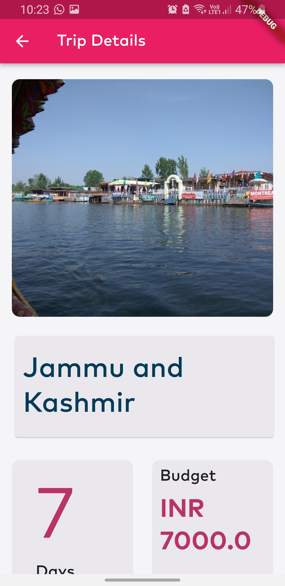|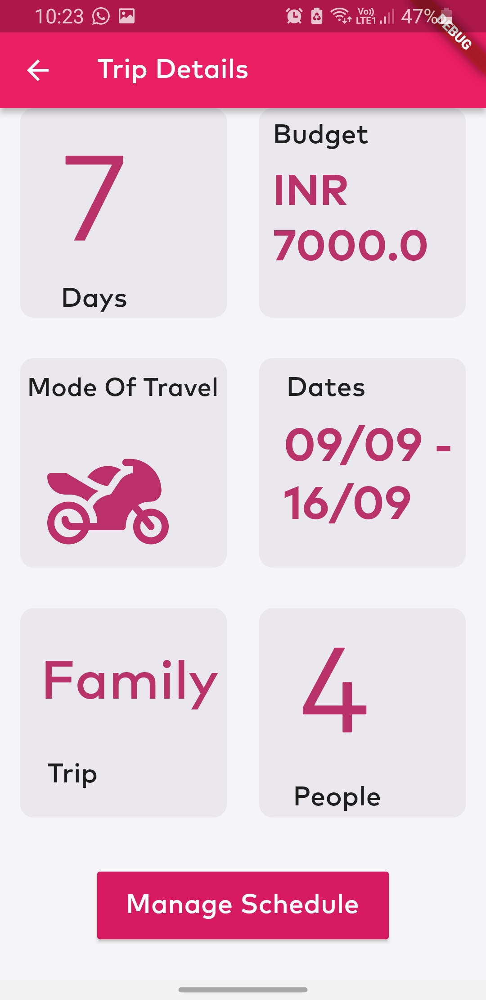|

| 17 | 18|
|------|-------|
|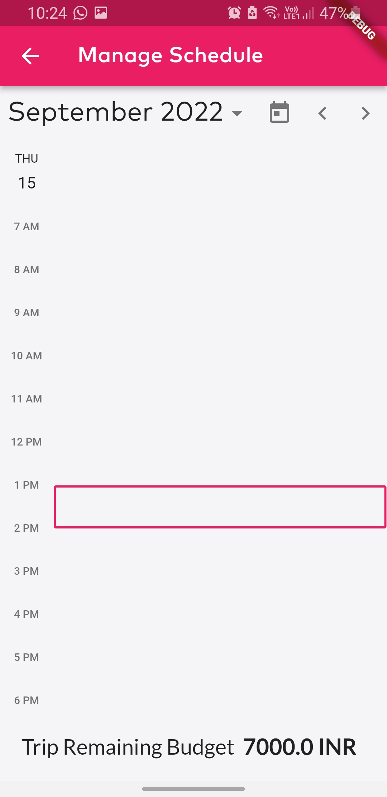|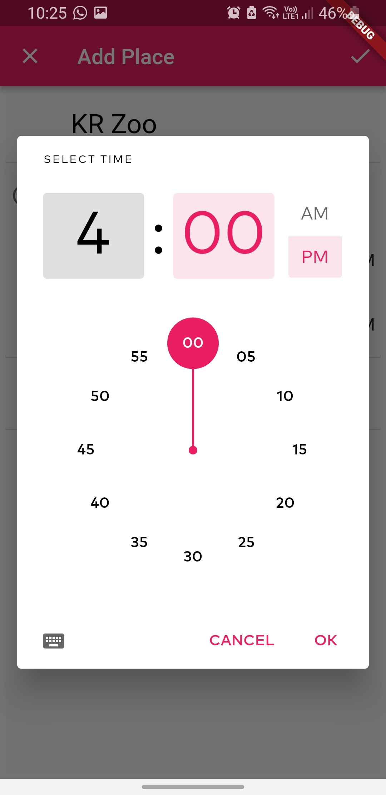|

| 19 | 20|
|------|-------|
|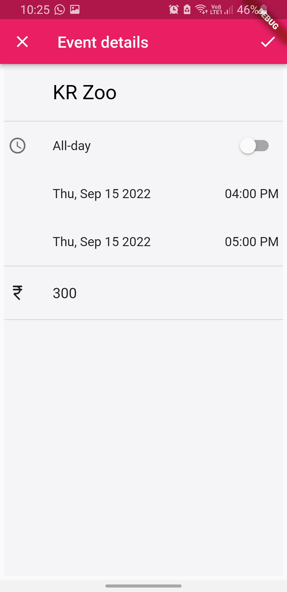|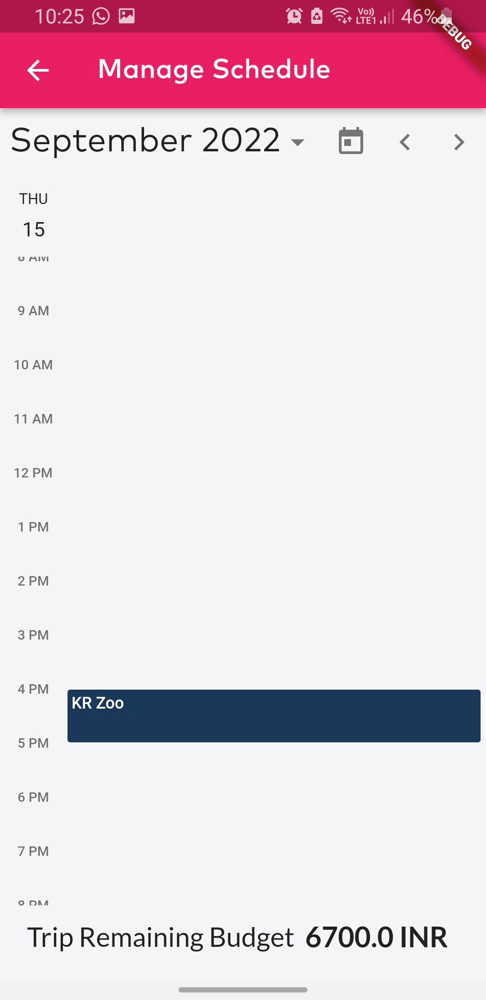|

| 21 |
|------|
|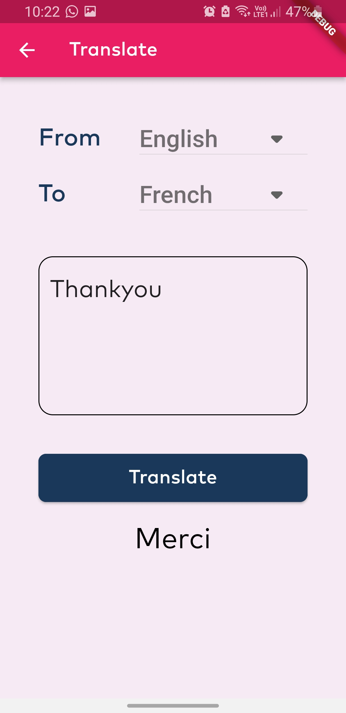|

## Installation
To run an instance of the application you will need a computer. Follow the following steps to run the app.

1. Download and install the latest version of Flutter SDK for your operating system .
2. Install an integrated IDE such as Android Studio or  Visual Studio Code.
3. Start an android or ios emulator (Only available for macs).
4. Alternatively, you can connect your android device to the system (Make sure USB Debugging permission is given for the device).
5. Now, Clone the application project files from the Travelaza github repository which can be found in the link https://github.com/yoonus47/travelaza
6. Finally navigate to the project folder location in a terminal or command prompt and run the command 'flutter run'

## Contributor(s)

[Muhammed Yoonus](https://github.com/yoonus47/)

[Sahir Nisar](https://github.com/sahirnisar/)

